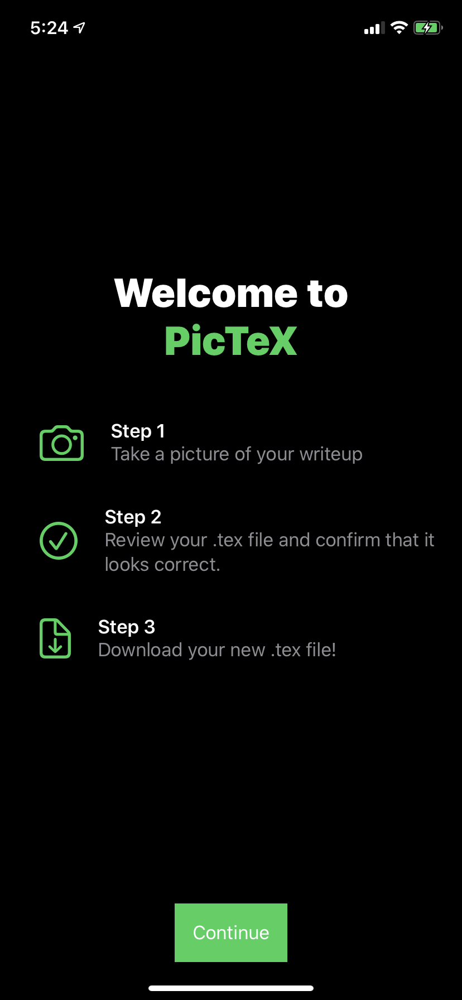
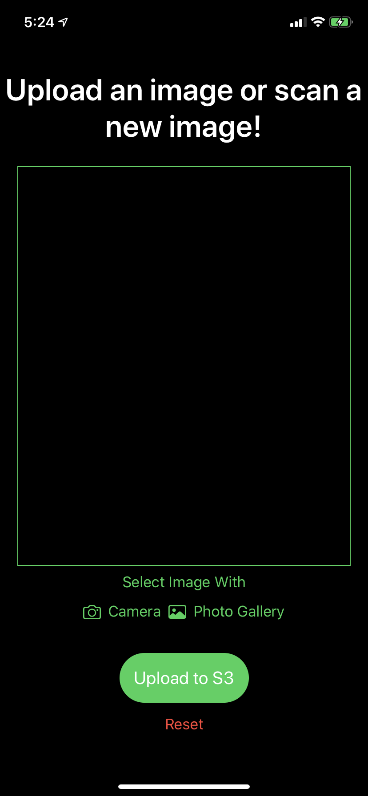
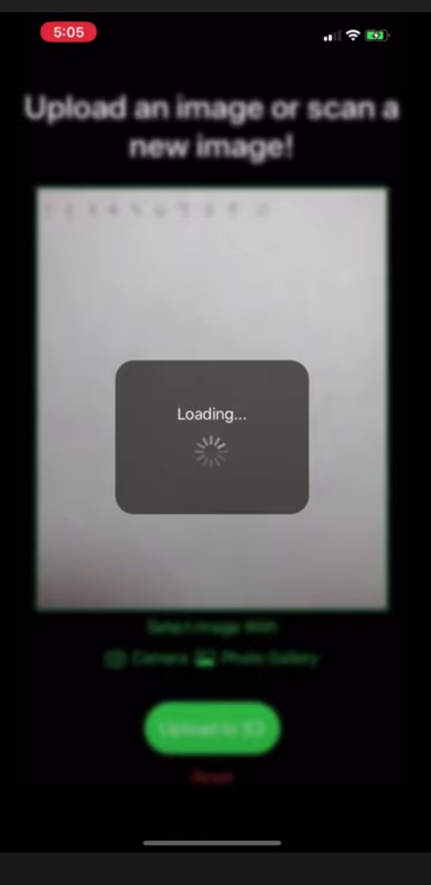

# PicTex

## Intro

This is a full-stack SwiftUI application developed with the AWS Amplify framework to deploy a PyTorch CNN in the cloud. Submitted for the [Global PyTorch Summer 2020 Hacakthon](https://devpost.com/software/pictex). Developed by Len Huang, Erica Chiang, and Zach Nowak.

Code for the SwiftUI iOS App can be found in the [`pictex`](https://github.com/lenghuang/picTex/tree/master/pictex) directory. Code for training the CNN with PyTorch, image object detection, and LaTeX conversion can be found in [`textDetectModel`](https://github.com/lenghuang/picTex/tree/master/textDetectModel) directory.

View our [demo video](http://www.youtube.com/watch?v=IQwyBaEmlQI) here.

## Reflections:

### Inspiration

As college students who often typeset assignments in LaTeX, we became interested in the possibility of creating an app that converts a handwritten document into a LaTeX file. We were really interested in learning more about computer vision and app development, so we decided to try implementing the idea and called it PicTeX.

### How We Created It

We created PicTeX by using an RCNN model to preprocess images for regions of interest and then use a classifier to identify each symbol. We used PyTorch to train our classifier and S3 buckets to integrate the object detection model functionality into an iOS app.

### Challenges We Ran Into

One of the most difficult parts of the project was developing a model to identify different symbols. We started with a You Only Look Once (YOLO) model for identifying symbols in a page, which ended up being too inaccurate. After switching to an approach using an RCNN model, it took quite a while to figure out the correct threshold levels and learning rates would lead to the most accurate model.

### Accomplishments

We are really proud of the way that we were able to create a handwriting recognition model from scratch and integrate it into an app that completes the entire handwriting-to-LaTeX process. It was our first time using PyTorch, AWS, and SwiftUI, so we were able to learn a lot from figuring out how to use each environment and working to combine them into one project.

### For the Future

We will definitely continue working on PicTeX in the future, and our first goals will be to develop a more accurate symbol classifier, as well as add more features to the user interface. We are very excited about the project and hope that it will be able to aid many people in the future!

## Screenshots

|    Initial Loading View     |       Landing View        |
| :-------------------------: | :-----------------------: |
|  |  |

|         Upload View         |       Loading View        |
| :-------------------------: | :-----------------------: |
|  |  |

|   Completed! Download View    |   View Your .tex File    |
| :---------------------------: | :----------------------: |
|  |  |
